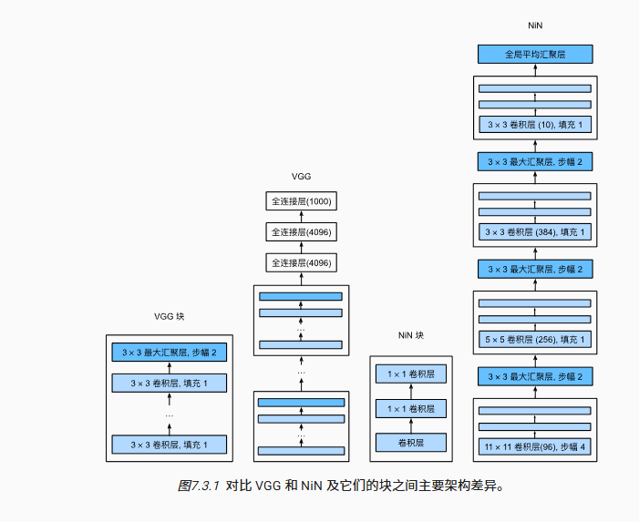

### 经典卷积神经网络（CNN）模型对比

| 模型 (年份) | 核心思想 | 网络结构 | 卷积核 | 关键创新 | 历史地位 |
| :--- | :--- | :--- | :--- | :--- | :--- |
| **AlexNet (2012)** | **开创性的技术集成**，证明深度学习在复杂图像任务上的巨大潜力。 | 结构相对“原始”，不规整，为适应当时硬件做了特殊设计。 | 使用了大小不一的卷积核（11x11, 5x5, 3x3）。 | ReLU, Dropout, 重叠池化, 数据增强, 多GPU训练。 | **开创者、引爆点**。让工业界和学术界真正相信了深度学习。 |
| **NiN (2013)** | **增强卷积层的局部抽象能力**，用微型网络代替传统线性卷积。 | 由堆叠的“NiN块”组成。用**全局平均池化 (GAP)** 替换了最后的全连接层。 | 混合使用不同尺寸的卷积核，但革命性地引入和重用了 **1x1 卷积核**。 | **NiN块 (MLPconv)**：用1x1卷积实现跨通道的特征整合。 **全局平均池化 (GAP)**：极大减少参数，增强模型可解释性。 | **思想的先行者**。其核心思想（1x1卷积和GAP）被后来的GoogLeNet和ResNet等模型广泛采纳并发扬光大。 |
| **VGG (2014)** | **探索深度**，证明通过简单、统一的模块堆叠，网络越深，性能越好。 | 结构非常**规整、统一**，由标准化的VGG块重复构成。 | **只使用3x3的小卷积核**。 | 证明了**深度**的重要性，提出了**模块化**的设计思想。 | **继承者、奠基者**。为后来的ResNet等更深的网络提供了设计思路和基准。 |

---

### VGG 和 NiN 的“块 (Block)”结构解析

这两个模型最大的特点就是“模块化”的设计思想，但它们“块”的内部逻辑却截然不同。

#### 1. VGG 块 (VGG Block) 的组成

VGG块的设计目标是**简洁和深度**。它像一个标准的乐高积木，非常规整。

一个典型的VGG块由两部分组成：

1.  **连续的N个卷积层**：
    *   **卷积核**：全部使用 **3x3** 的小卷积核。
    *   **填充 (Padding)**：使用 `padding=1`，确保在卷积后特征图的**高和宽不变**。
    *   **激活函数**：每个卷积层后都跟一个 **ReLU** 激活函数。
2.  **1个最大池化层 (Max Pooling)**：
    *   **作用**：在连续的特征提取后进行一次**降采样**。
    *   **参数**：通常使用 `pool_size=2, strides=2`。
    *   **效果**：将特征图的**高和宽减半**。

**VGG块的流程可以看作是：**

`[(卷积3x3 -> ReLU) * N次] -> 最大池化`

**简单来说，VGG块就是“先用小卷积核连续提纯特征，再通过池化来压缩信息”。** 整个VGG网络就是不断重复这个过程，同时在每个块之后将通道数翻倍（如 64 -> 128 -> 256...），从而构建出很深的网络。

#### 2. NiN 块 (NiN Block) 的组成

NiN块的设计目标是**提升单个卷积层的表达能力**。它认为传统的卷积层（一个线性滤波器 + 一个非线性激活）对于复杂的局部特征抽象能力不足。

因此，NiN块用一个**微型多层感知机（MLP）** 来替代传统的卷积操作，这个设计被称为 **MLPconv**。而这个微型MLP巧妙地用 **1x1 卷积** 来实现。

一个典型的NiN块由以下部分组成：

1.  **1个常规卷积层**：
    *   作用：和普通CNN一样，用于提取空间特征。卷积核大小可以是常规的 5x5 或 3x3 等。
    *   激活函数：后面跟一个 **ReLU**。
2.  **连续的M个 1x1 卷积层**：
    *   **这是NiN的核心！** 一个 **1x1 卷积** 可以看作是对输入特征图的**每个像素点**，在**通道维度**上做的一次**全连接**操作。
    *   **作用**：它不改变特征图的高和宽，但可以对不同通道的特征进行线性组合与信息交互，然后通过ReLU增加非线性。
    *   **效果**：连续使用多个1x1卷积层，就等于在每个像素位置上应用了一个小型的全连接网络（MLP），极大地增强了特征的抽象和表达能力。

**NiN块的流程可以看作是：**

`常规卷积 -> ReLU -> (1x1卷积 -> ReLU) * M次`

**简单来说，NiN块是“先用常规卷积提取空间信息，再用多个1x1卷积对每个像素点的通道信息进行深度加工和非线性变换”。** 它在不增加参数数量级的情况下，让模型学习到更复杂的特征组合。

**总结一下两者的核心区别：**

*   **VGG块** 是在 **空间维度** 上做文章，通过堆叠多个3x3卷积来扩大感受野，然后用池化层进行空间降维。
*   **NiN块** 是在 **通道维度** 上做文章，通过1x1卷积（MLPconv）来增强特征在通道间的复杂交互和非线性表达。
